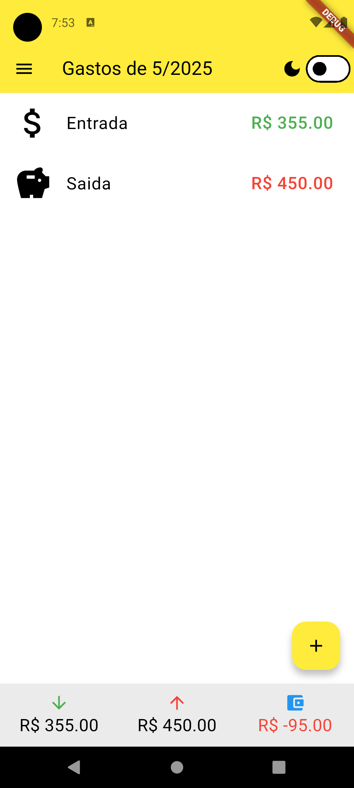

# 💸 App de Controle de Gastos Pessoais

Aplicativo mobile desenvolvido com Flutter para gerenciamento de finanças pessoais. Permite cadastrar gastos, categorizar, visualizar gráficos e consultar o histórico de gastos.

## 📱 Funcionalidades

- Cadastro de gastos/entradas com valor, data, categoria e descrição
- Visualização de despesas por mês
- Gráficos de pizza e linha para análise
- Armazenamento local com SQLite
- Interface responsiva

## 🚀 Tecnologias

- Flutter + Dart
- SQLite (armazenamento local)

## 📷 Imagens




## 📦 Como rodar o projeto

```bash
git clone https://github.com/seunome/controle-gastos.git
cd controle-gastos
flutter pub get
flutter run
